# gbrs

A Rust GameBoy emulator!

<table>
  <tr>
    <th>Tetris</th><th>Zelda: Link's Awakening</th>
  </tr>
  <tr>
    <td>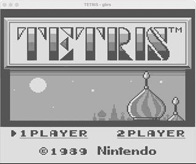</td>
    <td>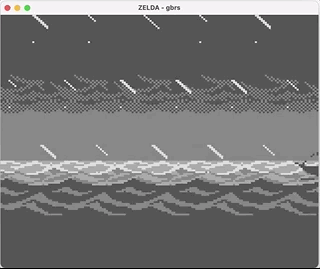</td>
  </tr>
  <tr>
    <th>Super Mario Land</th><th>Super Mario Land 2</th>
  </tr>
  <tr>
    <td>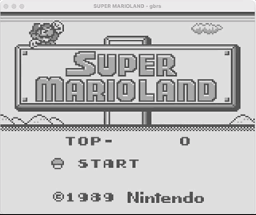</td>
    <td></td>
  </tr>
  <tr>
    <th>Galaga & Galaxian</th><th>Mortal Kombat</th>
  </tr>
  <tr>
    <td>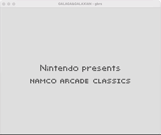</td>
    <td>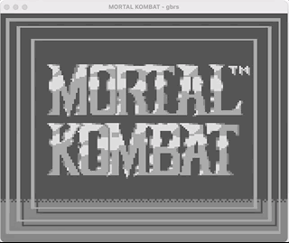</td>
  </tr>
  <tr>
    <th>Pac-Man</th><th>Alleyway</th>
  </tr>
  <tr>
    <td>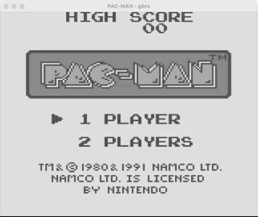</td>
    <td>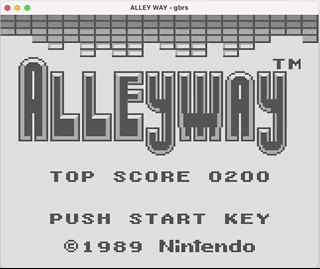</td>
  </tr>
  <tr>
    <th>Space Invaders</th><th>Road Rash</th>
  </tr>
  <tr>
    <td>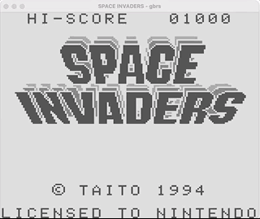</td>
    <td>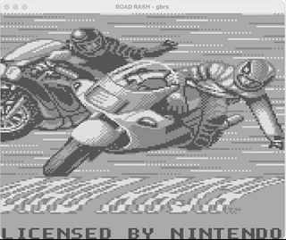</td>
  </tr>
  <tr>
    <th>Donkey Kong</th><th>Frogger</th>
  </tr>
  <tr>
    <td>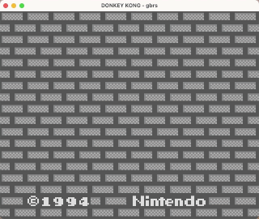</td>
    <td>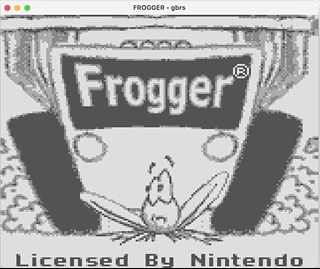</td>
  </tr>
  <tr>
    <th><a href="https://github.com/mattcurrie/dmg-acid2">dmg-acid2</a></th>
  </tr>
  <tr>
    <td>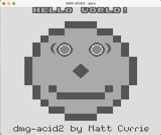</td>
  </tr>
</table>

## Support

gbrs supports:

- Mid-frame scanline effects (required for games like Road Rash)
- The Window (a GPU feature required for Pac Man and Zelda)
- Cycle-accurate CPU & counters
- Save files & saved games (Zelda & Super Mario Land 2 use these)
- The Window internal line counter (an unusual quirk required for perfect DMG-ACID2 rendering)
- LCD Stat interrupt bug (a bug present on the real Gameboy hardware required for Road Rash)
- Memory Board Controller 1 (MBCs are required for some more complex games)
- Memory Board Controller 2
- Sound!

& more!

## Progress so far

I'm still working on gbrs (and having a **_tonne_** of fun doing it!).

The main thing(s) I'm working on:

- Memory Board Controller 3 for Pokémon

## Building from source

gbrs is not yet finished enough to distribute binaries, but if you want to try it out:

The repo contains ports for multiple graphics backends. SDL is the easiest to build.

### SDL

The SDL port comes with everything you need to compile & run in one
command. If you experience issues with screen tearing or cracking
sound, check out the SFML port instead.

```bash
git clone https://github.com/adamsoutar/gbrs
cd gbrs/sdl-gui
cargo run --release ROM_PATH
```

(Replace ROM_PATH with the path to a .gb file)

### SFML

You'll need SFML set up, which you can find instructions for [here](https://github.com/jeremyletang/rust-sfml/wiki).

Afterwards, in a terminal, you can execute these commands, assuming you have a
[Rust](https://rustlang.org) toolchain installed.

```
git clone https://github.com/adamsoutar/gbrs
cd gbrs/sfml-gui
cargo run --release ROM_PATH
```

## Ports to non-PC platforms

gbrs is written to be ported to other platforms. Its default GUIs for Windows,
macOS and Linux are just modules that it doesn't _have_ to use.

You can port [gbrs-core](./core) to almost anything - especially since it
supports running _without_ the Rust StdLib.

All a port needs to do is:

```rust
use gbrs_core::cpu::Cpu;

let mut gameboy = Cpu::from_rom_bytes(
  include_bytes!("./tetris.gb").to_vec()
);

// Each frame:
gameboy.step_one_frame();
draw_screen(&gameboy.gpu.finished_frame);
// (where draw_screen is a platform-specific function left to the reader)
```

---

<h6 align="center">By Adam Soutar</h6>
