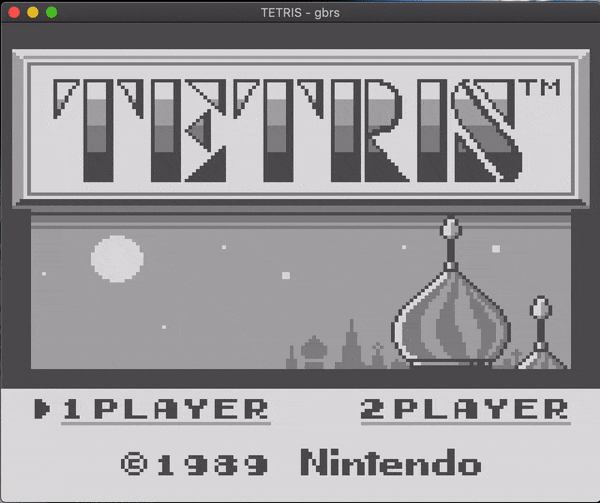

# gbrs

A Rust GameBoy emulator!



## Progress so far

gbrs is still in development, but running Tetris felt like a big enough
milestone to publish the source so far.

Currently, I'm working toward supporting Pokemon Red or Super Mario Land as
the next working game. I will also be working on sound support.

## Building from source

gbrs is not yet finished enough to distribute binaries, but if you want to try it out:

You'll need SFML set up, which you can find instructions for [here](https://github.com/jeremyletang/rust-sfml/wiki).

Afterwards, in a terminal, you can execute these commands, assuming you have a
[Rust](https://rustlang.org) toolchain installed.

```
git clone https://github.com/adamsoutar/gbrs
cd gbrs
cargo run --release ROM_PATH
```

(Replace ROM_PATH with the path to a .gb file)
